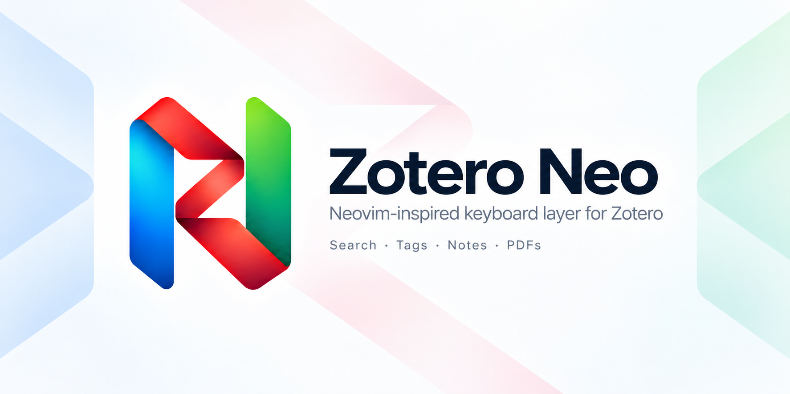

# Zotero Neo

Zotero Neo is a standalone, Neovim/LazyVim-inspired keyboard interaction layer
for Zotero's reader and main window.

> **Status:** Pre-release development. No public GitHub Release exists yet;
> build the XPI from source for development testing.

## Support

Zotero Neo supports the **latest stable Zotero release only**. The current
pre-release target is Zotero 10; older Zotero major versions are outside the
install and test contract.

Zotero Neo targets macOS, Linux, and Windows. GitHub Actions validates XPI
packaging on Ubuntu and Windows; Zotero GUI behavior still requires manual
verification in the current stable host.

## Major features

### Library and Main window

- Keyboard navigation across collections, saved searches, feeds, item lists, and
  tabs, including Vim-style `j/k`, `gg/G`, tree expansion/collapse, pane focus,
  PDF opening, tab switching/closing, trash, and restore.
- Native-backed **Item Select** for range selection with counts, endpoint swap,
  preserve/cancel semantics, and bulk actions without maintaining a parallel
  selected-item model.
- Better BibTeX citekey copying when Better BibTeX is available.

### Reader navigation

- Reader **Normal, Select, and Insert** interaction states.
- Page turns, scrolling, half/full-page movement, zoom, horizontal pan, native
  reading history, annotation navigation, and Zotero Reader search.
- Horizontal/vertical split control and directional pane focus.
- Link hints for visible internal, citation, and external PDF links.
- Keyboard explorers for PDF outline and persisted marks.
- Snapshot and EPUB navigation/search where Zotero exposes compatible Reader
  behavior.

### PDF text selection and actions

- Flash-assisted visible-text targeting for Select start/end with literal
  Unicode matching, CJK/IME input, bounded hint rendering, and stable labels.
- Range refinement by character/word/sentence/paragraph/line motions plus
  endpoint swapping.
- Copy, search, coloured highlight, underline, annotation comment, and Selection
  Actions workflows.
- Optional Translate for Zotero selection integration through its public API.

### Search, Picker, and commands

- Shared fuzzy Picker for all-library items, current-collection items, notes,
  tabs, and tags, backed by the pinned `fuzzysort` matcher.
- Command Palette in Reader and Main contexts, with actions projected from the
  active resolved binding map.
- Browser/Gecko-owned text input and IME composition for Picker, Tag Workspace,
  and Flash instead of reconstructing text from keydown events.

### Tags

- `<Space>fT` opens a keyboard-first **tag filter** workflow using Zotero's native
  item-view tag filter with AND semantics.
- `<Space>ta` opens a persistent **Tag Workspace** for Main/Reader/Note targets:
  bulk add/remove/create, explicit all/mixed/none state, and repeated mutations
  without reopening the UI.
- Optional virtual tag-path completion such as `method/...` while Zotero keeps
  ordinary flat tag strings as the authoritative data model.

### Notes

- Note search across normalized titles and note bodies.
- Child-note creation, right-side editor opening, note-tab opening, trash, and
  restore workflows.
- Keyboard Normal/Insert handoff inside Zotero note editors.

### Keymaps and appearance

- Configurable Reader/Main bindings with multiple bindings per action,
  duplicate blocking, prefix warnings, persistent unbinding, and staged Apply.
- Space-leader Key Guide derived from the active resolved keymap.
- Auto, Light, and Dark appearance modes on Neo-owned surfaces.

## Build from source

```bash
git clone https://github.com/zhongyangchuwu/Zotero-Neo.git
cd Zotero-Neo
npm ci
./tools/build.sh
```

The output is `zotero-neo.xpi`. On Windows:

```powershell
powershell -ExecutionPolicy Bypass -File tools\build.ps1
```

Install development builds in Zotero through **Tools → Plugins → Install Plugin
From File…** and restart when prompted.

## Documentation

- [User guide](docs/USER_GUIDE.md) — modes, bindings, workflows, and settings.
- [Architecture](docs/ARCHITECTURE.md) — interaction scopes, feature ownership,
  semantic actions, and Zotero host boundaries.
- [Item Select and Tag Workspace](docs/TAG_WORKSPACE.md) — bulk item selection,
  item-tag editing, and virtual tag-path semantics.
- [Input methods](docs/INPUT_METHODS.md) — Unicode/IME ownership and composition
  boundaries.
- [Development guide](docs/DEVELOPMENT.md) — build, CI, release, host seams, and
  debugging constraints.
- [Roadmap](docs/ROADMAP.md) — work planned before and after the first release.
- [Issue tracker](https://github.com/zhongyangchuwu/Zotero-Neo/issues) — current bugs and tracked host/API limitations.
- [Changelog](CHANGELOG.md)

## License and provenance

Zotero Neo is independently developed and is not maintained as an upstream-compatible
fork. Its history began from code in
[Zotero Vim Plus](https://github.com/ZorroStardust/zotero-vim-plus), which itself
incorporated work from [zotero-vim](https://codeberg.org/finktank/zotero-vim).
Historical copyright notices are preserved under the project license.

[GNU Affero General Public License v3.0](LICENSE) (AGPL-3.0).
